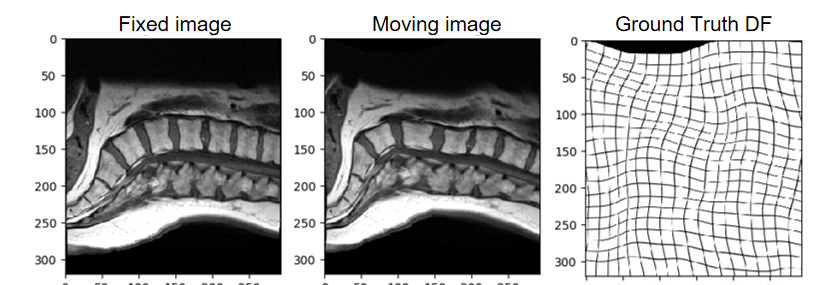
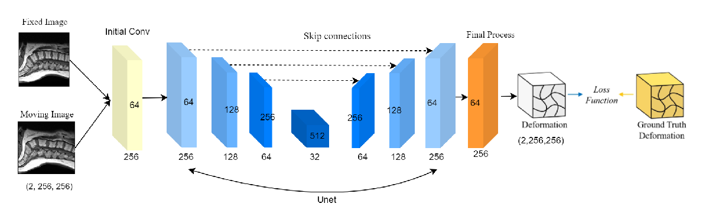

# Remove Your One Deformation: Supervised Learning for Deformable Image Registration


The main goal of our project is to use a neural network to predict the deformation field between two given spine MRI images in a supervised learning method.  The ground truth is the deformation field. 



This project aims to predict deformation fields given two spine MRI images using a neural network in a supervised learning setting. The primary focus is to enhance the accuracy and applicability of deformation field predictions in medical imaging, particularly for spine MRI scans.

## Project Overview

We employ 2D MRI slices in PNG format and 3D MRI data in NPY format. The ground truth for our model training is derived from deformation fields created using Perlin noise. Our neural network model is based on the U-Net architecture, which is known for its effectiveness in medical image segmentation tasks.

### Data

- **2D MRI Slices**: These are provided in PNG format and represent individual slices of spine MRI scans.
- **3D MRI Data**: These are provided in NPY format, offering a comprehensive volumetric view of the spine MRI.

### Model Architecture

We utilize a U-Net-based neural network to predict deformation fields. U-Nets are particularly well-suited for this task due to their encoder-decoder structure, which allows for precise localization and segmentation tasks.



### Ground Truth

The ground truth deformation fields are generated using Perlin noise. This method introduces realistic variations and deformations that help in training a robust model capable of handling real-world data.

### Experiments and Validation

After training our model, we conducted extensive validation on real-world MRI slices. These images were sourced from different MRI scanners, including those from Siemens and Philips. This step was crucial to demonstrate the model's effectiveness and generalizability across different scanning devices.
## File Structure

Registration/<br/>
├── MRI_2D_Experiments/<br/>
│   ├── model_for_eval/<br/>
│   │   ├── images/<br/>
│   │   ├── logs/<br/>
│   │   ├── metrics/<br/>
│   │   ├── best_model.pth<br/>
│   │   ├── config.txt<br/>
│   │   └── model_config.txt<br/>
│   ├── training_scripts/<br/>
│   │   ├── eval_2D-MRI_realworld_data.py<br/>
│   │   └── train_2D-MRI_synthetic_samples.py<br/>
├── MRI_3D_Experiments/<br/>
│   ├── model_for_eval/<br/>
│   │   ├── images/<br/>
│   │   ├── logs/<br/>
│   │   ├── metrics/<br/>
│   │   ├── config.txt<br/>
│   │   └── losses.csv<br/>
│   ├── training_scripts/<br/>
│   │   ├── eval_3D-MRI_realworld_data.py<br/>
│   │   └── train_3D-MRI_synthetic_samples.py<br/>
├── networks/<br/>
│   ├── diffusion_unet.py<br/>
│   └── diffusion_unet3D.py<br/>
├── others/<br/>
│   ├── input.png<br/>
│   └── model.png<br/>
├── src/<br/>
│   ├── FreeFormDeformation.py<br/>
│   ├── FreeFormDeformation3D.py<br/>
│   └── perlin.py<br/>
├── .gitignore<br/>
├── README.md<br/>
├── environment.yml<br/>


## Getting Started

### Prerequisites

Clone, create environment and install dependencies:

```bash
git clone https://github.com/leond32/Registration.git
conda env create -f environment.yml
conda activate adlm1
```

### **Datasets**

All the datasets we used are stored on the server and have already been well-preprocessed

1. The 2D MRI dataset is located at: `/vol/aimspace/projects/practical_SoSe24/registration_group/datasets/MRI_Slices_PNG/MRI_slices_diff_res`.
2. The 2D real-world dataset is located at: `/vol/aimspace/projects/practical_SoSe24/registration_group/datasets/processed_png_real_world_2D`.
3. The 3D MRI dataset is located at: `/vol/aimspace/projects/practical_SoSe24/registration_group/datasets/MRI-numpy-removeblack-nopadding`.
4. The 3D real-world MRI dataset is located at: `/vol/aimspace/projects/practical_SoSe24/registration_group/datasets/Real-World_3D`.

## **Training and Evaluation**

- In `Registration/MRI_2D_Experiments/model_for_eval` and `Registration/MRI_3D_Experiments/model_for_eval` respectively, there are pre-trained models and results of their performance on the synthetic validation data.

### **Prepare the Data**: 
- Ensure that your 2D MRI slices and 3D MRI data are correctly formatted and placed in the appropriate directories.
- This is already done, if you use the datasets we provided.

### **Train the 2D Model**: Run the training script with the 2D MRI dataset.
    
    
    python Registration/MRI_2D_Experiments/training_scripts/train_2D-MRI_synthetic_samples.py
    
The results, model configuration, and model weights file will be saved in `Registration/MRI_2D_Experiments/experiment_runs_training`. This directory will contain the following items (This is the same for the 3D-training respectively):

-**Directories**:
- images: Contains various plots and visualizations generated during the training process and the model evaluation.
- logs: Stores log files that record the details of the training process, including initial hyperparameter settings, training settings, and loss-logging
- metrics: Contains files related to the evaluation metrics calculated during the validation of the model.

-**Files**:
- best_model.pth: This file contains the weights of the best-performing model based on the validation performance during training.
- checkpoint.pth: A checkpoint file that saves the model weights and other training parameters at a specific point in time, allowing the training process to be resumed from this point if needed.
- config.txt: A configuration file that includes the parameters and settings of the model used for the training process.
- losses.csv: A CSV file that logs the training and validation losses over epochs, useful for analyzing the training performance and identifying any issues such as overfitting or underfitting.

### **Evaluate the 2D Model**: Run the evaluation script with the 2D real-world MRI dataset. 

    
    python Registration/MRI_2D_Experiments/training_scripts/eval_2D-MRI_realworld_data.py
    
The results, model configuration, and model weights file will be saved in `Registration/MRI_2D_Experiments/experiment_runs_eval`. Ensure that you use the correct model weights.
- By default, the model `Registration/MRI_2D_Experiments/model_for_eval/best_model.pt` is loaded. (You may need to unzip it)


### **Train the 3D Model**: Run the training script with the 3D MRI dataset. 
    
    
    python Registration/MRI_3D_Experiments/training_scripts/train_3D-MRI_synthetic_samples.py

The results, model configuration, and model weights file will be saved in `/vol/aimspace/projects/practical_SoSe24/registration_group/Registration/MRI_3D_Experiments/experiment_runs_training`.


### **Evaluate the 3D Model**: Run the evaluation script with the 3D real-world MRI dataset. 
    
    
    python Registration/MRI_3D_Experiments/training_scripts/eval_3D-MRI_realw

The results, model configuration, and model weights file will be saved in `Registration/MRI_3D_Experiments/experiment_runs_eval`. Ensure that you use the correct model weights.
- By default, the model `Registration/MRI_3D_Experiments/model_for_eval/best_model.pt` is loaded. (You may need to unzip it)
